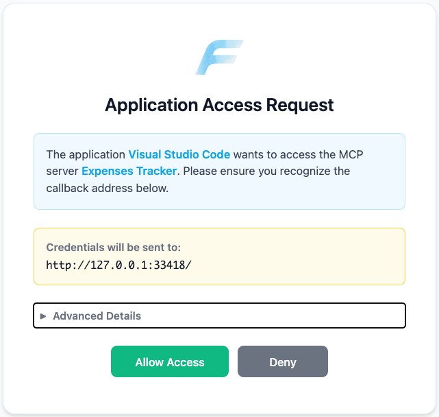
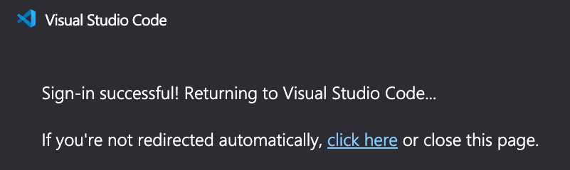
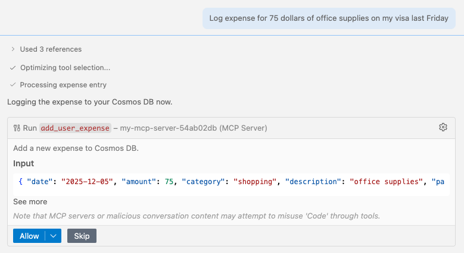
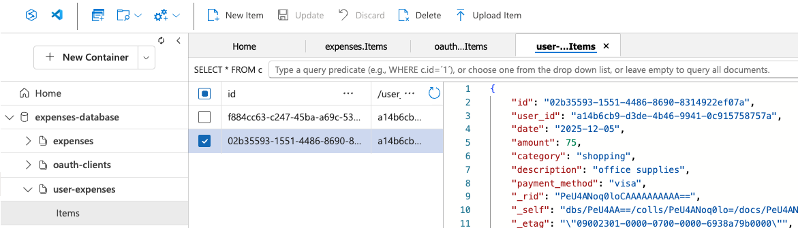

# Python MCP Demo

Un proyecto de demostración que muestra implementaciones del Model Context Protocol (MCP) usando FastMCP, con ejemplos de transporte stdio y HTTP, integración con LangChain y Agent Framework, y despliegue en Azure Container Apps.

## Tabla de contenidos

- [Empezar](#empezar)
  - [GitHub Codespaces](#github-codespaces)
  - [VS Code Dev Containers](#vs-code-dev-containers)
  - [Entorno local](#entorno-local)
- [Correr servidores MCP locales](#correr-servidores-mcp-locales)
  - [Usar con GitHub Copilot](#usar-con-github-copilot)
  - [Depurar con VS Code](#depurar-con-vs-code)
  - [Inspeccionar con MCP Inspector](#inspeccionar-con-mcp-inspector)
  - [Ver trazas con Aspire Dashboard](#ver-trazas-con-aspire-dashboard)
- [Correr Agentes <-> MCP](#correr-agentes---mcp)
- [Desplegar en Azure](#desplegar-en-azure)
- [Desplegar en Azure con red privada](#desplegar-en-azure-con-red-privada)
- [Desplegar en Azure con autenticación Keycloak](#desplegar-en-azure-con-autenticacion-keycloak)
- [Desplegar en Azure con Entra OAuth Proxy](#desplegar-en-azure-con-entra-oauth-proxy)

## Empezar

Hay varias opciones para configurar este proyecto. La forma más rápida es GitHub Codespaces, porque te prepara todas las herramientas, pero también podés configurarlo localmente.

### GitHub Codespaces

Podés correr este proyecto de forma virtual usando GitHub Codespaces. Hacé clic en el botón para abrir una instancia web de VS Code en tu navegador:

[](https://codespaces.new/pamelafox/python-mcp-demo)

Una vez abierto el Codespace, abrí una terminal y continuá con los pasos de despliegue.

### VS Code Dev Containers

Otra opción relacionada es VS Code Dev Containers, que abre el proyecto en tu VS Code local usando la extensión [Dev Containers](https://marketplace.visualstudio.com/items?itemName=ms-vscode-remote.remote-containers):

1. Iniciá Docker Desktop (instalálo si todavía no lo tenés)
2. Abrí el proyecto: [](https://vscode.dev/redirect?url=vscode://ms-vscode-remote.remote-containers/cloneInVolume?url=https://github.com/pamelafox/python-mcp-demo)
3. En la ventana de VS Code que se abre, cuando aparezcan los archivos (puede tardar varios minutos), abrí una terminal.
4. Continuá con los pasos de despliegue.

### Entorno local

Si no usás una de las opciones anteriores, necesitás:

1. Asegurate de tener instaladas estas herramientas:
   - [Azure Developer CLI (azd)](https://aka.ms/install-azd)
   - [Python 3.13+](https://www.python.org/downloads/)
   - [Docker Desktop](https://www.docker.com/products/docker-desktop/)
   - [Git](https://git-scm.com/downloads)

2. Cloná el repositorio y abrí la carpeta del proyecto.

3. Creá y activá un [entorno virtual de Python](https://docs.python.org/3/tutorial/venv.html#creating-virtual-environments).

4. Instalá las dependencias:

   ```bash
   uv sync
   ```

5. Copiá `.env-sample` a `.env` y configurá tus variables de entorno:

   ```bash
   cp .env-sample .env
   ```

6. Editá `.env` con tus credenciales de API. Elegí uno de los siguientes proveedores definiendo `API_HOST`:
   - `github` - GitHub Models (requiere `GITHUB_TOKEN`)
   - `azure` - Azure OpenAI (requiere credenciales de Azure)
   - `ollama` - Instancia local de Ollama
   - `openai` - OpenAI API (requiere `OPENAI_API_KEY`)

## Correr servidores MCP locales

Este proyecto incluye servidores MCP en el directorio [`servers/`](../servers/):

| Archivo | Descripción |
|------|-------------|
| [servers/basic_mcp_stdio.py](../servers/basic_mcp_stdio.py) | Servidor MCP con transporte stdio para integración con VS Code |
| [servers/basic_mcp_http.py](../servers/basic_mcp_http.py) | Servidor MCP con transporte HTTP en el puerto 8000 |
| [servers/deployed_mcp.py](../servers/deployed_mcp.py) | Servidor MCP para despliegue en Azure con Cosmos DB y autenticación opcional con Keycloak |

Los servidores locales (`basic_mcp_stdio.py` y `basic_mcp_http.py`) implementan un "Expenses Tracker" con una herramienta para agregar gastos a un archivo CSV.

### Usar con GitHub Copilot

El archivo `.vscode/mcp.json` configura los servidores MCP para integrarlos con GitHub Copilot:

**Servidores disponibles:**

- **expenses-mcp**: servidor stdio para uso normal
- **expenses-mcp-debug**: servidor stdio con debugpy en el puerto 5678
- **expenses-mcp-http**: servidor HTTP en `http://localhost:8000/mcp`. Debés iniciarlo manualmente con `uv run servers/basic_mcp_http.py` antes de usarlo.

**Cambiar servidores:**

Configurá qué servidor usa GitHub Copilot abriendo el panel de Chat, seleccionando el ícono de herramientas y eligiendo el servidor deseado de la lista.


**Ejemplo de entrada:**

Usá una consulta como esta para probar el servidor de gastos MCP:

```text
Registrá un gasto de 50 dólares de pizza en mi Amex hoy
```


### Depurar con VS Code

El `.vscode/launch.json` provee una configuración de depuración para adjuntarse a un servidor MCP.

**Para depurar un servidor MCP con GitHub Copilot Chat:**

1. Poné breakpoints en el código del servidor MCP en `servers/basic_mcp_stdio.py`.
2. Iniciá el servidor de depuración vía la configuración en `mcp.json` seleccionando `expenses-mcp-debug`.
3. Presioná `Cmd+Shift+D` para abrir Run and Debug.
4. Elegí la configuración "Attach to MCP Server (stdio)".
5. Presioná `F5` o el botón de play para iniciar el debugger.
6. Seleccioná el servidor `expenses-mcp-debug` en las herramientas de GitHub Copilot Chat.
7. Usá GitHub Copilot Chat para disparar las tools MCP.
8. El debugger se detendrá en los breakpoints.

### Inspeccionar con MCP Inspector

El [MCP Inspector](https://github.com/modelcontextprotocol/inspector) es una herramienta para probar y depurar servidores MCP.

> Nota: Si bien los servidores HTTP pueden funcionar con port forwarding en Codespaces/Dev Containers, la configuración del MCP Inspector y el adjunte del debugger no es tan directa. Para la mejor experiencia de desarrollo con debugging completo, recomendamos correr este proyecto localmente.

**Para servidores stdio:**

```bash
npx @modelcontextprotocol/inspector uv run servers/basic_mcp_stdio.py
```

**Para servidores HTTP:**

1. Iniciá el servidor HTTP:

   ```bash
   uv run servers/basic_mcp_http.py
   ```

2. En otra terminal, corré el inspector:

   ```bash
   npx @modelcontextprotocol/inspector http://localhost:8000/mcp
   ```

El inspector provee una interfaz web para:

- Ver tools, recursos y prompts disponibles
- Probar invocaciones de tools con parámetros personalizados
- Inspeccionar respuestas y errores del servidor
- Depurar la comunicación del servidor

### Ver trazas con Aspire Dashboard

Podés usar el [.NET Aspire Dashboard](https://learn.microsoft.com/dotnet/aspire/fundamentals/dashboard/standalone) para ver trazas, métricas y logs de OpenTelemetry del servidor MCP.

> Nota: La integración con Aspire Dashboard solo está configurada para el servidor HTTP (`basic_mcp_http.py`).

1. Iniciá el Aspire Dashboard:

   ```bash
   docker run --rm -d -p 18888:18888 -p 4317:18889 --name aspire-dashboard \
       mcr.microsoft.com/dotnet/aspire-dashboard:latest
   ```

   > El Aspire Dashboard expone su endpoint OTLP en el puerto 18889 del contenedor. El mapeo `-p 4317:18889` lo hace disponible en el puerto estándar OTLP 4317 del host.

   Obtené la URL del dashboard y el token de login desde los logs del contenedor:

   ```bash
   docker logs aspire-dashboard 2>&1 | grep "Login to the dashboard"
   ```

2. Activá OpenTelemetry agregando esto a tu archivo `.env`:

   ```bash
   OTEL_EXPORTER_OTLP_ENDPOINT=http://localhost:4317
   ```

3. Iniciá el servidor HTTP:

   ```bash
   uv run servers/basic_mcp_http.py
   ```

4. Visitá el dashboard en: http://localhost:18888

---

## Correr Agentes <-> MCP

Este proyecto incluye agentes de ejemplo en el directorio [`agents/`](../agents/) que demuestran cómo conectar agentes de IA a servidores MCP:

| Archivo | Descripción |
|------|-------------|
| [agents/agentframework_learn.py](../agents/agentframework_learn.py) | Integración del Microsoft Agent Framework con MCP |
| [agents/agentframework_http.py](../agents/agentframework_http.py) | Integración del Microsoft Agent Framework con el servidor MCP de gastos local |
| [agents/langchainv1_http.py](../agents/langchainv1_http.py) | Agente LangChain con integración MCP |
| [agents/langchainv1_github.py](../agents/langchainv1_github.py) | Demo de filtrado de herramientas LangChain con GitHub MCP (requiere `GITHUB_TOKEN`) |

**Para correr un agente:**

1. Primero iniciá el servidor MCP HTTP:

   ```bash
   uv run servers/basic_mcp_http.py
   ```

2. En otra terminal, corré un agente:

   ```bash
   uv run agents/agentframework_http.py
   ```

Los agentes se conectan al servidor MCP y te permiten interactuar con las herramientas de seguimiento de gastos mediante una interfaz de chat.

---

## Desplegar en Azure

Este proyecto puede desplegarse en Azure Container Apps usando Azure Developer CLI (azd). El despliegue aprovisiona:

- **Azure Container Apps** - Hospeda tanto el servidor MCP como el agente
- **Azure OpenAI** - Provee el LLM para el agente
- **Azure Cosmos DB** - Almacena los datos de gastos
- **Azure Container Registry** - Almacena imágenes de contenedores
- **Log Analytics** - Monitoreo y diagnósticos

### Configuración de cuenta de Azure

1. Creá una [cuenta gratuita de Azure](https://azure.microsoft.com/free/) y una Suscripción de Azure.
2. Verificá que tengas los permisos necesarios:
   - Tu cuenta debe tener permisos `Microsoft.Authorization/roleAssignments/write`, como [Role Based Access Control Administrator](https://learn.microsoft.com/azure/role-based-access-control/built-in-roles#role-based-access-control-administrator-preview), [User Access Administrator](https://learn.microsoft.com/azure/role-based-access-control/built-in-roles#user-access-administrator) o [Owner](https://learn.microsoft.com/azure/role-based-access-control/built-in-roles#owner).
   - Tu cuenta también necesita permisos `Microsoft.Resources/deployments/write` a nivel de suscripción.

### Desplegar con azd

1. Iniciá sesión en Azure:

   ```bash
   azd auth login
   ```

   Para usuarios de GitHub Codespaces, si falla el comando anterior, probá:

   ```bash
   azd auth login --use-device-code
   ```

2. Creá un nuevo entorno de azd:

   ```bash
   azd env new
   ```

   Esto creará una carpeta dentro de `.azure` con el nombre de tu entorno.

3. Aprovisioná y desplegá los recursos:

   ```bash
   azd up
   ```

   Te pedirá seleccionar suscripción y región. Esto tarda varios minutos.

4. Al finalizar, se creará un archivo `.env` con las variables necesarias para correr los agentes localmente contra los recursos desplegados.

### Costos

Los precios varían por región y uso, así que no es posible predecir costos exactos para tu caso.

Podés usar la [calculadora de precios de Azure](https://azure.com/e/3987c81282c84410b491d28094030c9a) para estos recursos:

- **Azure OpenAI Service**: nivel S0, modelo GPT-4o-mini. El precio se basa en tokens. [Precios](https://azure.microsoft.com/pricing/details/cognitive-services/openai-service/)
- **Azure Container Apps**: nivel de consumo. [Precios](https://azure.microsoft.com/pricing/details/container-apps/)
- **Azure Container Registry**: nivel estándar. [Precios](https://azure.microsoft.com/pricing/details/container-registry/)
- **Azure Cosmos DB**: nivel serverless. [Precios](https://azure.microsoft.com/pricing/details/cosmos-db/)
- **Log Analytics** (Opcional): Pago por uso. Costos por datos ingeridos. [Precios](https://azure.microsoft.com/pricing/details/monitor/)

⚠️ Para evitar costos innecesarios, recordá dar de baja la app si ya no la usás, borrando el grupo de recursos en el Portal o ejecutando `azd down`.

---

## Desplegar en Azure con red privada

Para demostrar seguridad mejorada en despliegues de producción, este proyecto soporta desplegar con una configuración de red virtual (VNet) que restringe el acceso público a los recursos de Azure.

1. Definí estas variables de entorno de azd para crear una red virtual y endpoints privados para Container App, Cosmos DB y OpenAI:

   ```bash
   azd env set USE_VNET true
   azd env set USE_PRIVATE_INGRESS true
   ```

   Los recursos de Log Analytics y ACR mantendrán acceso público para que puedas desplegar y monitorear la app sin VPN. En producción, normalmente también los restringirías.

2. Aprovisioná y desplegá:

   ```bash
   azd up
   ```

### Costos adicionales por red privada

Al usar configuración de VNet, se aprovisionan recursos adicionales:

- **Virtual Network**: Pago por uso. Costos por datos procesados. [Precios](https://azure.microsoft.com/pricing/details/virtual-network/)
- **Azure Private DNS Resolver**: Precio por mes, endpoints y zonas. [Precios](https://azure.microsoft.com/pricing/details/dns/)
- **Azure Private Endpoints**: Precio por hora por endpoint. [Precios](https://azure.microsoft.com/pricing/details/private-link/)

---

## Desplegar en Azure con autenticación Keycloak

Este proyecto soporta desplegar con autenticación OAuth 2.0 usando Keycloak como proveedor de identidad, implementando la [especificación MCP OAuth](https://modelcontextprotocol.io/specification/2025-03-26/basic/authorization) con Dynamic Client Registration (DCR).

### Qué se despliega

| Componente | Descripción |
|-----------|-------------|
| **Container App de Keycloak** | Keycloak 26.0 con realm preconfigurado |
| **Configuración de rutas HTTP** | Enrutamiento basado en reglas: `/auth/*` → Keycloak, `/*` → Servidor MCP |
| **Servidor MCP protegido con OAuth** | FastMCP con validación JWT contra el endpoint JWKS de Keycloak |

### Pasos de despliegue

1. Activá autenticación con Keycloak:

   ```bash
   azd env set MCP_AUTH_PROVIDER keycloak
   ```

2. Definí la contraseña de admin de Keycloak (requerido):

   ```bash
   azd env set KEYCLOAK_ADMIN_PASSWORD "TuPasswordSegura123!"
   ```

3. Opcional: personalizá el nombre del realm (por defecto: `mcp`):

   ```bash
   azd env set KEYCLOAK_REALM_NAME "mcp"
   ```

4. Desplegá en Azure:

   ```bash
   azd up
   ```

   Esto creará el entorno de Azure Container Apps, desplegará Keycloak con el realm preconfigurado, desplegará el servidor MCP con validación OAuth y configurará el enrutamiento basado en rutas HTTP.

5. Verificá el despliegue consultando los outputs:

   ```bash
   azd env get-value MCP_SERVER_URL
   azd env get-value KEYCLOAK_DIRECT_URL
   azd env get-value KEYCLOAK_ADMIN_CONSOLE
   ```

6. Visitá la consola de administración de Keycloak para verificar el realm:

   ```text
   https://<tu-mcproutes-url>/auth/admin
   ```

   Iniciá sesión con `admin` y tu contraseña configurada.

### Probar con el agente

1. Generá el archivo de entorno local (se crea automáticamente después de `azd up`):

   ```bash
   ./infra/write_env.sh
   ```

   Esto crea `.env` con `KEYCLOAK_REALM_URL`, `MCP_SERVER_URL` y configuraciones de Azure OpenAI.

2. Corré el agente:

   ```bash
   uv run agents/agentframework_http.py
   ```

   El agente detecta `KEYCLOAK_REALM_URL` en el entorno y se autentica vía DCR + client credentials. Al éxito, agregará un gasto e imprimirá el resultado.

### Limitaciones conocidas (trade-offs de la demo)

| Ítem | Actual | Recomendación para producción | Por qué |
|------|--------|-------------------------------|--------|
| Modo de Keycloak | `start-dev` | `start` con configuración adecuada | El modo dev tiene defaults de seguridad relajados |
| Base de datos | H2 en memoria | PostgreSQL | H2 no persiste datos entre reinicios |
| Réplicas | 1 (por H2) | Múltiples con DB compartida | H2 es en memoria, no comparte estado |
| Acceso a Keycloak | Público (URL directa) | Solo interno vía rutas | La URL de rutas no se conoce hasta después del despliegue |
| DCR | Abierto (anónimo) | Requerir initial access token | Cualquier cliente puede registrarse sin auth |

> Nota: Keycloak debe ser públicamente accesible porque su URL se genera dinámicamente por Azure. La validación del issuer del token requiere una URL conocida, pero la URL de mcproutes no está disponible hasta después del despliegue. Usar un dominio personalizado lo solucionaría.

---

## Desplegar en Azure con Entra OAuth Proxy

Este proyecto soporta desplegar con Microsoft Entra ID (Azure AD) usando el proxy de OAuth de Azure incorporado en FastMCP. Es una alternativa a Keycloak que usa Microsoft Entra con tu tenant de Azure para la gestión de identidad.

### Qué se despliega con Entra OAuth

| Componente | Descripción |
|-----------|-------------|
| **App Registration de Microsoft Entra** | Se crea automáticamente durante el aprovisionamiento con URIs de redirección para desarrollo local, VS Code y producción |
| **Servidor MCP protegido con OAuth** | FastMCP con AzureProvider para autenticación OAuth |
| **Almacenamiento de clientes OAuth en CosmosDB** | Persiste registros de clientes OAuth entre reinicios del servidor |

### Pasos de despliegue para Entra OAuth

1. Activá el proxy de Entra OAuth:

   ```bash
   azd env set MCP_AUTH_PROVIDER entra_proxy
   ```

2. Definí tu tenant ID para crear la App Registration en el tenant correcto:

   ```bash
   azd env set AZURE_TENANT_ID "<tu-tenant-id>"
   ```

3. Desplegá en Azure:

   ```bash
   azd up
   ```

   Durante el despliegue:
   - **Hook de preprovision**: Crea una App Registration de Microsoft Entra con un secreto de cliente, y guarda las credenciales en variables de entorno de azd
   - **Hook de postprovision**: Actualiza la App Registration con la URL del servidor desplegado como URI de redirección adicional

4. Verificá el despliegue consultando los outputs:

   ```bash
   azd env get-value MCP_SERVER_URL
   azd env get-value ENTRA_PROXY_AZURE_CLIENT_ID
   ```

### Variables de entorno

Las siguientes variables de entorno se definen automáticamente por los hooks de despliegue:

| Variable | Descripción |
|----------|-------------|
| `ENTRA_PROXY_AZURE_CLIENT_ID` | ID de cliente de la App Registration |
| `ENTRA_PROXY_AZURE_CLIENT_SECRET` | Secreto de cliente de la App Registration |

Estas luego se escriben a `.env` por el hook de postprovision para desarrollo local.

### Probar localmente

Después del despliegue, podés probar localmente con OAuth habilitado:

```bash
# Correr el servidor MCP
cd servers && uvicorn auth_mcp:app --host 0.0.0.0 --port 8000
```

El servidor usará la App Registration de Entra para OAuth y CosmosDB para almacenamiento de clientes.

### Usar el servidor MCP con Entra OAuth en GitHub Copilot

La App Registration de Entra incluye estas URIs de redirección para VS Code:

- `https://vscode.dev/redirect` (VS Code web)
- `http://127.0.0.1:{33418-33427}` (helper local de auth de VS Code desktop, 10 puertos)

Para usar el servidor MCP desplegado con GitHub Copilot Chat:

1. Para evitar conflictos, detené los servidores MCP de `mcp.json` y deshabilitá los servidores de gastos en las herramientas de GitHub Copilot Chat.
2. Seleccioná "MCP: Add Server" desde la Paleta de Comandos de VS Code.
3. Elegí "HTTP" como tipo de servidor.
4. Ingresá la URL del servidor MCP, ya sea desde la variable de entorno `MCP_SERVER_URL` o `http://localhost:8000/mcp` si corrés localmente.
5. Si ves un error "Client ID not found", abrí la Paleta de Comandos, ejecutá **"Authentication: Remove Dynamic Authentication Providers"** y seleccioná la URL del servidor MCP. Esto limpia tokens OAuth cacheados y fuerza un flujo de autenticación nuevo. Luego reiniciá el servidor para que vuelva a pedir OAuth.
6. Deberías ver una pantalla de autenticación de FastMCP en tu navegador. Seleccioná "Allow access":

   

7. Tras otorgar acceso, el navegador redirige a una página de VS Code con "Sign-in successful!" y vuelve el foco a VS Code.

   

8. Habilitá el servidor MCP en las herramientas de GitHub Copilot Chat y probalo con una consulta de seguimiento de gastos:

   ```text
   Registrá un gasto de 75 dólares de artículos de oficina en mi Visa el viernes pasado
   ```

   

9. Verificá que el gasto se agregó revisando el contenedor `user-expenses` de Cosmos DB en el Portal de Azure.

   
